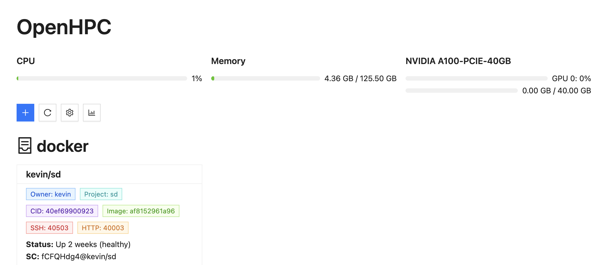
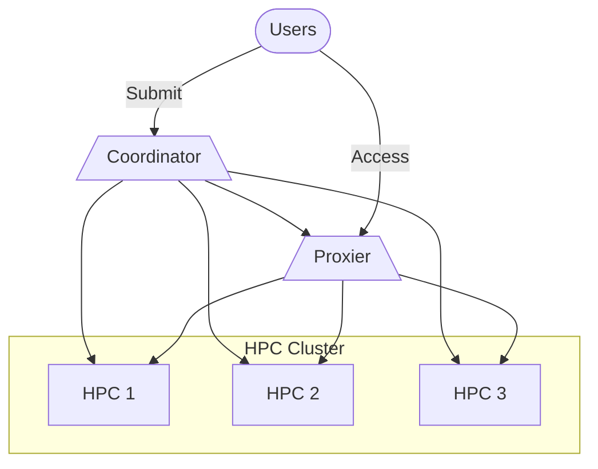

# Kigland OpenHPC

A lightweight workload scheduler. Similar to Slurm, but simpler and easier for small-size distributed HPC cluster.

## Overview

What we have done:

- Multi GPU Assignment
- Safe Environment environment for different users
- Multi port access (HTTP, SSH, ...) (Simple Proxier)
- Web Portal

TODO:

- Job Queue
- Job Scheduler (SJF/FCFS)
- User Portal
- Multiple Physical Node Coordination
- ...

## Architecture

