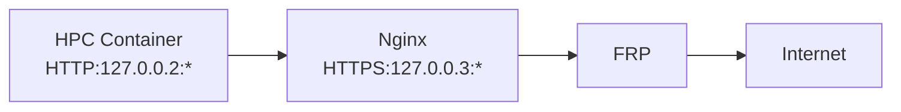

# Proxier



## Nginx (HTTP to HTTPS)

To do encryption, we need to use SSL.

### Increase the limit of open files

```
sudo systemctl edit --full nginx.service
```

In nginx.service, add the following line to `[Service]` section:

```
LimitNOFILE=819200
```

Then, reload the service:

```
sudo systemctl daemon-reload
sudo systemctl restart nginx
```

### Apply HTTP to HTTPS configuration

Related nginx config files is at `nginx/http2https.conf`.


## FRP (Expose Local Service to Internet)

```
{{- range $_, $v := parseNumberRangePair "40000-42000" "40000-42000" }}
[[proxies]]
name = "hpc-proxy-{{ $v.First }}"
type = "tcp"
localIP = "127.0.0.3"
localPort = {{ $v.First }}
remotePort = {{ $v.Second }}
{{- end }}
```