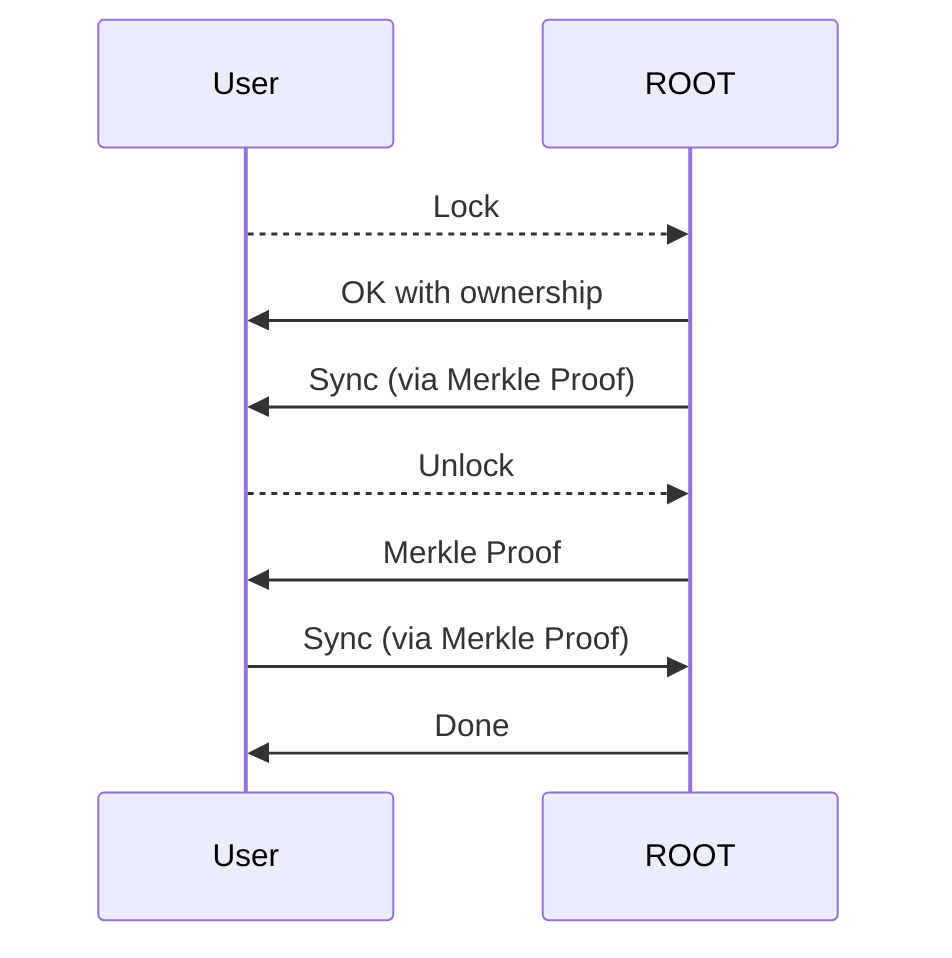
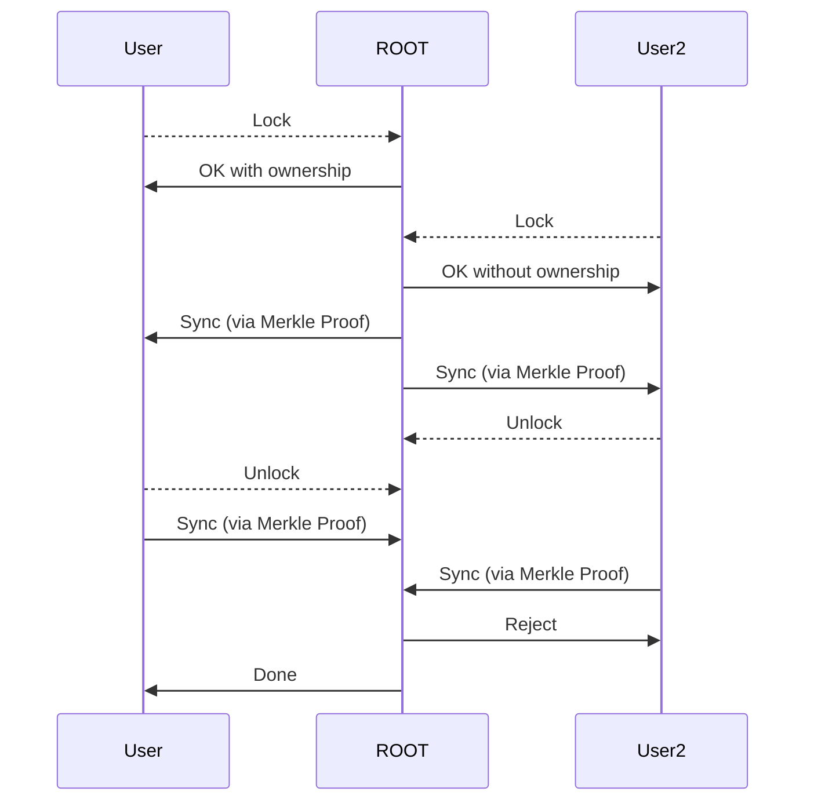

# Research File System

> [!NOTE]
> This is a **draft**. Even not in the milestone plan.

Basic Idea: each chunk of data is exclusive transactionally to each user.

Every operation in FS will create a critical section.



We may want to reject the second locker, because they are not the owner of the chunk.



We can create the critical section via:

```python
file_server = FileServer('master_node_ip')
fh = file_server.lock('/rds/data/user_id/dataset', ownership=True)
if not fh.ok:
    fh.force_sync()
```

During the lock, the file server will do sync with the master node.

After everything up, we can do:

```python
fh.unlock()
```

The file server will do the sync to the master node.